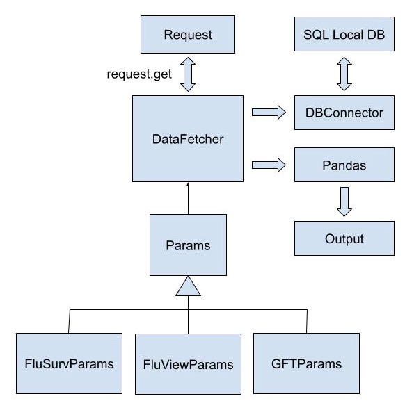

# Fetch Data Using Customized Middleware

## Overview

We built this middleware to help us fetch the API request and meanwhile store the data into a local database in the consideration of future access. This middleware can automatically handle the case of duplicated entries and also provide a convenient interface for constructing the parameters for the API request.

The lcoal database is named as `influenza_data.sqlite` in the folder `data`.

For basic usage to start up, you can refer to the **[Basic Usage](#basic-usage)** section.

For more details about the structure of this middleware, you can refer to the **[Architecture](#architecture)** section.

## Basic Usage 

### Database Access

You can create an instance of `DBConnector` to open the connection to the created database. For example:

``` python
from endpoint_type import EndpointType
from db_connector import DBConnector

db_connector = DBConnector()
```

After creating an instance of `DBConnector` you can pass the query into the member function named as `read()`. 

> **Note:** You might need a helper function named `DBConnector.resolveTableName()` to get the corresponding table name according to the endpoint type you are using. 
> 
> For detail, you can refer to the section of **[Retrieve Table Name](#retrieve-table-name)**.

Demo for using a query to read:

``` python
query = f'''
select * from {DBConnector.resolveTableName(EndpointType.FLUSURV)}
group by locations
'''

db_connector.read(query)
```

### Fetch Data Through Endpoint

#### Endpoint

There are several different endpoints defined in file [`code/endpoint_type.py`](../code/endpoint_type.py)

For example, you can declare a endpoint by using `EndpointType.FLUSURV`.

#### Construct Parameters

For initiating a Web API request, a query string will be passed. Hence, you need to construct a parameter (the query string) first. Several class already provided in folder `code` in order to create the parameter.

For example, if you want to initiate a API request for `FluSurv`, you can construct the `FluSurvParam` first like this:

``` python
flusurv_param = FluSurvParams(
    epiweeks = [
        202001, 
        202003, 
        202005-202008
    ],
    regions = [
        FluSurvRegion.CA, 
        FluSurvRegion.CO
    ]
)
```

#### Initiate the API request

After creating the params, you can initiate the API request like this:

``` python
DataFetcher.fetch(EndpointType.FLUSURV, param=flusurv_param)
# A dataframe is returns. 
# By default, the result will be automatically stored into the local database.
```

> Note: `fetch` is a static function defined under `DataFetcher`. You can checke the implementation of `DataFetcher` in this [file](../code/data_fetcher.py).


## Architecture 

The architecture diagram is like this:




## Helper Functions

### Retrieve Table Name

Since this middleware handles the internal storage of data and create the table for you. You might not know the table name which is required for a query. For handle this issue, there is a static method in `DBConnector` named `resolveTableName` to help you overcome the problem.

Code Demo:

``` python
DBConnector.resolveTableName(EndpointType.FLUSURV)
# it returns the table name as "flusurv".
```

### Retrieve the Path of Different Folders

You can use `PahResolver`, which is defined in this [file](../code/dir_path_resolver.py), to obtain the path to several folders in this project programmatically.

For example, if you want to know the absolute path for the `code` folder on your machine, you can use `PathResolver.code_dir`.
